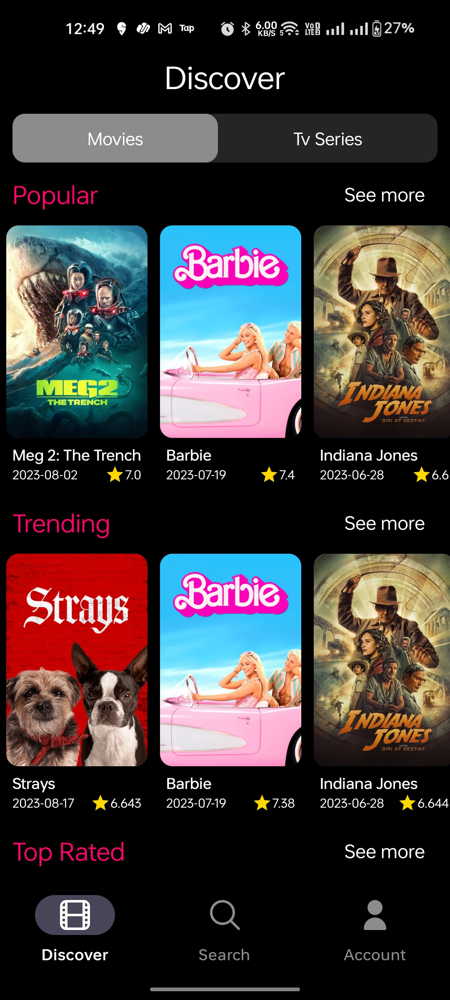
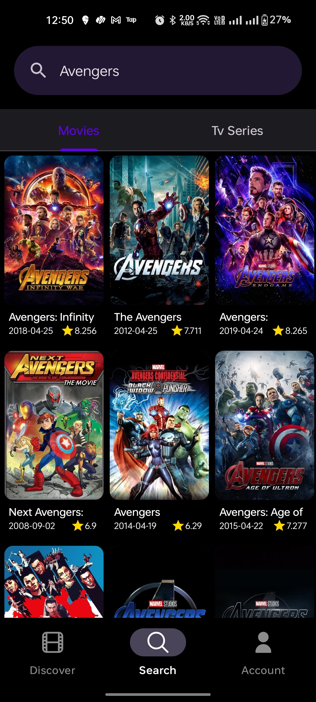
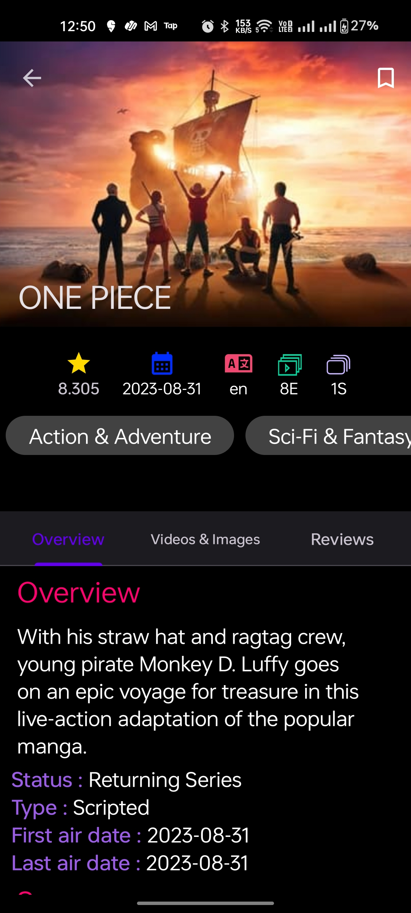
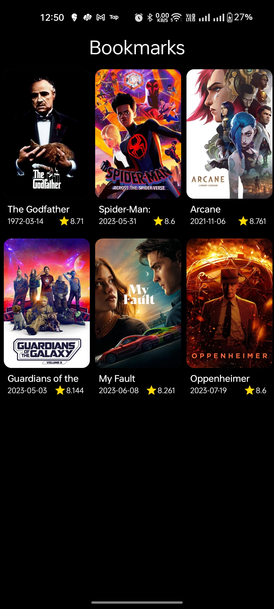

# Neetflix

This is a movie searching and movie details app using TMDB API.

## Tech Stack & Libraries

- Jetpack
    - [Navigation](https://developer.android.com/jetpack/compose/navigation): For navigating screens
    - [Room](https://developer.android.com/training/data-storage/room): An abstraction layer over
      SQLite to allow fluent database access
    - [ViewModel](https://developer.android.com/topic/libraries/architecture/viewmodel): A business
      logic or screen level state holder.
- [Coroutines](https://developer.android.com/kotlin/coroutines)
  with [Flow](https://developer.android.com/kotlin/flow) for asynchronous.
- [Retrofit](https://square.github.io/retrofit/) for networking.
- [Gson](https://github.com/google/gson) for serialisation.
- [Glide](https://github.com/bumptech/glide): An image loading library for Android.
- [Material Components for Android](https://m3.material.io/) for UI.

## Architecture

The app follows
the [official architecture guidance](https://developer.android.com/topic/architecture) for Android
apps.

## API Key

Create a account on [TMDB](https://developer.themoviedb.org/docs/getting-started) to obtain the
secret keys then you can set them in ```~/apikey.properties``` to access the API.

```

API_KEY = 'Your API Key'

```

## Screenshots

|                              Splash                               |                            Home                            |                            Search                            |
|:-----------------------------------------------------------------:|:----------------------------------------------------------:|:------------------------------------------------------------:|
|  |  |  |

|                            Details                            |                            Bookmarked                             |                                  Seasons                                  |
|:-------------------------------------------------------------:|:-----------------------------------------------------------------:|:-------------------------------------------------------------------------:|
|  |  |  |

|                                Episode                                |                                 Cast                                  |
|:---------------------------------------------------------------------:|:---------------------------------------------------------------------:|
|  |  | 

## License

```
Apache License 2.0
```
